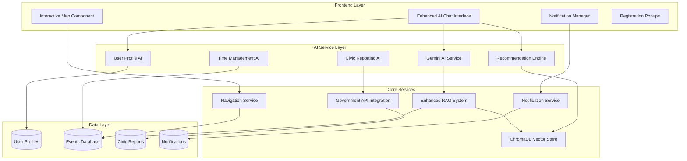

# AI-Enhanced User Experience System Design

## Overview

This design document outlines the architecture for an advanced AI-powered user experience system that builds upon the existing EventMap AI infrastructure. The system will provide personalized event recommendations, intelligent registration assistance, time management, notifications, navigation support, and civic reporting capabilities through a conversational AI interface.

## Architecture

### High-Level Architecture



## Components and Interfaces

### 1. Enhanced User Profile System

**Purpose**: Stores and manages user preferences, behavior patterns, and personalization data.

**Key Components**:
- `UserProfileManager`: Manages user preference collection and updates
- `BehaviorAnalyzer`: Analyzes user search and registration patterns
- `PreferenceExtractor`: Extracts preferences from user interactions

**Interfaces**:
```javascript
interface UserProfile {
  userId: string;
  preferences: {
    categories: string[];
    locations: string[];
    priceRange: { min: number; max: number };
    timePreferences: string[];
  };
  behaviorHistory: {
    searches: SearchHistory[];
    registrations: RegistrationHistory[];
    interactions: InteractionHistory[];
  };
  personalInfo: {
    location: Coordinates;
    timezone: string;
    notificationPreferences: NotificationSettings;
  };
}
```

### 2. Intelligent Recommendation Engine

**Purpose**: Provides personalized event suggestions based on user profiles and behavior.

**Key Components**:
- `RecommendationAlgorithm`: Core recommendation logic using collaborative filtering and content-based filtering
- `ExplanationGenerator`: Creates explanations for why events were recommended
- `DiversityManager`: Ensures recommendation diversity

**Interfaces**:
```javascript
interface Recommendation {
  eventId: string;
  score: number;
  explanation: string;
  reasoning: {
    categoryMatch: number;
    locationMatch: number;
    timeMatch: number;
    behaviorMatch: number;
  };
}
```

### 3. Registration Assistant

**Purpose**: Guides users through event registration with AI assistance.

**Key Components**:
- `RegistrationFlow`: Manages the registration process
- `ConflictDetector`: Identifies scheduling conflicts
- `ConfirmationManager`: Handles registration confirmations and popups

**Interfaces**:
```javascript
interface RegistrationAssistant {
  initiateRegistration(eventId: string, userId: string): Promise<RegistrationFlow>;
  checkConflicts(eventId: string, userId: string): Promise<Conflict[]>;
  completeRegistration(registrationData: RegistrationData): Promise<RegistrationResult>;
}
```

### 4. Time Management System

**Purpose**: Helps users manage their event schedules and optimize their time.

**Key Components**:
- `ScheduleManager`: Manages user event schedules
- `ConflictResolver`: Suggests solutions for scheduling conflicts
- `TravelTimeCalculator`: Calculates travel times between events

**Interfaces**:
```javascript
interface TimeManagement {
  getSchedule(userId: string, dateRange: DateRange): Promise<Schedule>;
  detectConflicts(userId: string, newEvent: Event): Promise<Conflict[]>;
  suggestOptimalSchedule(userId: string, events: Event[]): Promise<OptimizedSchedule>;
}
```

### 5. Enhanced Notification System

**Purpose**: Sends intelligent, timely notifications about events and registrations.

**Key Components**:
- `NotificationScheduler`: Schedules notifications based on user preferences
- `NotificationPersonalizer`: Customizes notification content
- `DeliveryManager`: Manages multi-channel notification delivery

**Interfaces**:
```javascript
interface NotificationService {
  scheduleEventReminder(eventId: string, userId: string): Promise<void>;
  sendPersonalizedRecommendations(userId: string): Promise<void>;
  notifyScheduleChanges(userId: string, changes: ScheduleChange[]): Promise<void>;
}
```

### 6. Navigation and Direction System

**Purpose**: Provides intelligent navigation assistance for event locations.

**Key Components**:
- `RouteCalculator`: Calculates optimal routes to events
- `TrafficAnalyzer`: Incorporates real-time traffic data
- `LocationAssistant`: Helps users find specific venues

**Interfaces**:
```javascript
interface NavigationService {
  getDirections(from: Coordinates, to: Coordinates): Promise<Route>;
  getOptimalDepartureTime(eventId: string, userLocation: Coordinates): Promise<Date>;
  trackUserLocation(userId: string): Promise<LocationUpdate>;
}
```

### 7. Civic Reporting System

**Purpose**: Allows users to report infrastructure issues and notifies government officials.

**Key Components**:
- `IssueClassifier`: Categorizes civic issues
- `GovernmentNotifier`: Routes reports to appropriate officials
- `ImpactAnalyzer`: Assesses how issues affect event accessibility

**Interfaces**:
```javascript
interface CivicReporting {
  submitReport(report: CivicReport): Promise<ReportResult>;
  notifyOfficials(report: CivicReport): Promise<NotificationResult>;
  updateEventAccessibility(report: CivicReport): Promise<void>;
}
```

## Data Models

### Enhanced User Model
```javascript
const enhancedUserSchema = {
  // Existing fields
  name: String,
  email: String,
  password: String,
  role: String,
  
  // New AI-enhanced fields
  profile: {
    preferences: {
      categories: [String],
      locations: [String],
      priceRange: { min: Number, max: Number },
      timePreferences: [String],
      accessibilityNeeds: [String]
    },
    behaviorHistory: {
      searches: [{
        query: String,
        timestamp: Date,
        results: [String], // Event IDs
        selectedEvents: [String]
      }],
      registrations: [{
        eventId: String,
        timestamp: Date,
        rating: Number,
        feedback: String
      }],
      interactions: [{
        type: String, // 'chat', 'search', 'registration'
        content: String,
        timestamp: Date
      }]
    },
    personalInfo: {
      location: {
        type: { type: String, default: 'Point' },
        coordinates: [Number] // [longitude, latitude]
      },
      timezone: String,
      notificationPreferences: {
        email: Boolean,
        sms: Boolean,
        push: Boolean,
        reminderTiming: [Number] // Hours before event
      }
    }
  },
  
  aiSettings: {
    personalizationEnabled: { type: Boolean, default: true },
    dataCollectionConsent: { type: Boolean, required: true },
    lastProfileUpdate: Date
  }
};
```

### Notification Model
```javascript
const notificationSchema = {
  userId: { type: mongoose.Schema.Types.ObjectId, ref: 'User' },
  type: {
    type: String,
    enum: ['reminder', 'recommendation', 'update', 'conflict', 'civic']
  },
  title: String,
  message: String,
  data: mongoose.Schema.Types.Mixed, // Additional data
  channels: [String], // ['email', 'sms', 'push']
  scheduledFor: Date,
  sentAt: Date,
  status: {
    type: String,
    enum: ['scheduled', 'sent', 'failed', 'cancelled'],
    default: 'scheduled'
  }
};
```

### Civic Report Model
```javascript
const civicReportSchema = {
  reporterId: { type: mongoose.Schema.Types.ObjectId, ref: 'User' },
  type: {
    type: String,
    enum: ['road_blockage', 'drainage', 'traffic', 'infrastructure', 'safety']
  },
  description: String,
  location: {
    type: { type: String, default: 'Point' },
    coordinates: [Number],
    address: String
  },
  severity: {
    type: String,
    enum: ['low', 'medium', 'high', 'critical'],
    default: 'medium'
  },
  images: [String], // URLs to uploaded images
  status: {
    type: String,
    enum: ['reported', 'acknowledged', 'in_progress', 'resolved'],
    default: 'reported'
  },
  affectedEvents: [{ type: mongoose.Schema.Types.ObjectId, ref: 'Event' }],
  governmentResponse: {
    officialId: String,
    message: String,
    timestamp: Date
  },
  createdAt: { type: Date, default: Date.now },
  updatedAt: Date
};
```

## Correctness Properties

*A property is a characteristic or behavior that should hold true across all valid executions of a system-essentially, a formal statement about what the system should do. Properties serve as the bridge between human-readable specifications and machine-verifiable correctness guarantees.*

### Property 1: User Preference Collection
*For any* new user interaction with the AI Assistant, the system should collect and store user preferences through conversational questions
**Validates: Requirements 1.1**

### Property 2: Search Pattern Recording
*For any* user search for events, the User Profile System should record and update search patterns and preferences in the user's profile
**Validates: Requirements 1.2**

### Property 3: Registration Profile Updates
*For any* user event registration, the system should update the user's interest profile based on the event's categories and characteristics
**Validates: Requirements 1.3**

### Property 4: Personalized Recommendations
*For any* user request for event recommendations, the Event Recommendation Engine should analyze user profile data and suggest relevant events with explanations
**Validates: Requirements 2.1, 2.2**

### Property 5: Registration Guidance
*For any* user expression of interest in an event, the Registration Assistant should guide them through the registration process and display confirmation popups upon completion
**Validates: Requirements 3.1, 3.2**

### Property 6: Schedule Conflict Detection
*For any* user event registration, the Time Management Assistant should check for schedule conflicts with existing registrations and notify the user
**Validates: Requirements 4.1**

### Property 7: Notification Scheduling
*For any* user event registration, the Notification Service should schedule appropriate reminder notifications based on user preferences
**Validates: Requirements 5.1**

### Property 8: Navigation Assistance
*For any* user request for directions to a registered event, the Navigation System should provide real-time route guidance with optimal departure times
**Validates: Requirements 6.1**

### Property 9: Civic Report Processing
*For any* civic issue report submitted by a user, the system should collect detailed information and automatically notify relevant government officials
**Validates: Requirements 7.1, 7.2**

### Property 10: Natural Language Understanding
*For any* user question in natural language, the AI Assistant should understand the intent and provide contextually appropriate responses
**Validates: Requirements 8.1**

### Property 11: Real-time Data Access
*For any* request for event information, the AI Assistant should access and provide current event data including availability and updates
**Validates: Requirements 9.1**

### Property 12: Privacy Compliance
*For any* user data collection, the system should obtain explicit consent and clearly explain data usage before storing personal information
**Validates: Requirements 10.1**

## Security and Privacy Implementation

### Data Protection
- **Encryption**: All user profile data encrypted at rest using AES-256
- **API Security**: JWT tokens with refresh mechanism for API authentication
- **Data Anonymization**: Personal identifiers removed from analytics and government reports
- **Consent Management**: Granular consent tracking for different data usage types

### Privacy Controls
- **Data Retention**: Automatic deletion of personal data after user-specified periods
- **Export/Delete**: User-initiated data export and deletion capabilities
- **Audit Logging**: Comprehensive logging of all data access and modifications
- **Third-party Sharing**: Explicit opt-in required for any external data sharing

## Performance Optimization

### AI Processing
- **Response Caching**: Cache frequent AI responses to reduce API calls
- **Batch Processing**: Group similar requests for efficient processing
- **Load Balancing**: Distribute AI workload across multiple service instances
- **Async Operations**: Non-blocking processing for time-intensive AI tasks

### Data Management
- **Vector Indexing**: Optimized ChromaDB indexing for fast similarity searches
- **Database Optimization**: Proper indexing on frequently queried fields
- **CDN Integration**: Static assets and images served via CDN
- **Connection Pooling**: Efficient database connection management

## Government API Integration

### API Specifications
- **Municipal APIs**: Integration with city/county reporting systems
- **State Systems**: Connection to state-level infrastructure databases
- **Federal Integration**: Links to relevant federal reporting mechanisms
- **Standardization**: Common data format for cross-jurisdictional compatibility

### Integration Architecture
```javascript
interface GovernmentAPI {
  jurisdiction: string;
  apiEndpoint: string;
  authMethod: 'oauth' | 'apikey' | 'certificate';
  reportTypes: string[];
  responseFormat: 'json' | 'xml';
  statusTracking: boolean;
}
```

### Fallback Mechanisms
- **Email Routing**: Automatic email generation when APIs are unavailable
- **Manual Processing**: Queue for manual review when automated routing fails
- **Multi-channel Delivery**: Attempt multiple contact methods for critical issues

## Error Handling

### AI Service Failures
- **Gemini API Unavailable**: Fallback to local NLP processing and cached responses
- **Vector Search Failures**: Use traditional text-based search as backup
- **Recommendation Engine Errors**: Provide popular events as fallback recommendations
- **Context Loss**: Maintain conversation state in persistent storage

### Data Consistency
- **Profile Update Conflicts**: Use optimistic locking with conflict resolution
- **Notification Delivery Failures**: Implement retry mechanisms with exponential backoff
- **Schedule Synchronization**: Maintain event-driven consistency across user schedules
- **Cross-service Transactions**: Implement saga pattern for distributed operations

### External Service Integration
- **Government API Failures**: Queue civic reports for later delivery with status tracking
- **Map Service Outages**: Provide cached directions and alternative route suggestions
- **Notification Service Downtime**: Store notifications for delayed delivery with priority queuing
- **Real-time Data Lag**: Implement graceful degradation with timestamp indicators

## Testing Strategy

### Unit Testing
- Test individual AI components with mock data
- Verify user profile management functions
- Test notification scheduling and delivery logic
- Validate civic reporting data processing

### Property-Based Testing
- Generate random user profiles and verify recommendation consistency
- Test schedule conflict detection with various event combinations
- Validate notification timing across different user preferences
- Test civic report routing to appropriate government officials

### Integration Testing
- Test end-to-end user registration flows
- Verify AI conversation continuity across multiple interactions
- Test real-time data synchronization between services
- Validate cross-component data consistency

### AI-Specific Testing
- Test conversation flow management and context retention
- Verify recommendation explanation accuracy
- Test natural language understanding across diverse inputs
- Validate personalization effectiveness over time

The testing approach will use **Jest** for unit testing and **fast-check** for property-based testing, with a minimum of 100 iterations per property test to ensure comprehensive coverage of the AI system's behavior patterns.